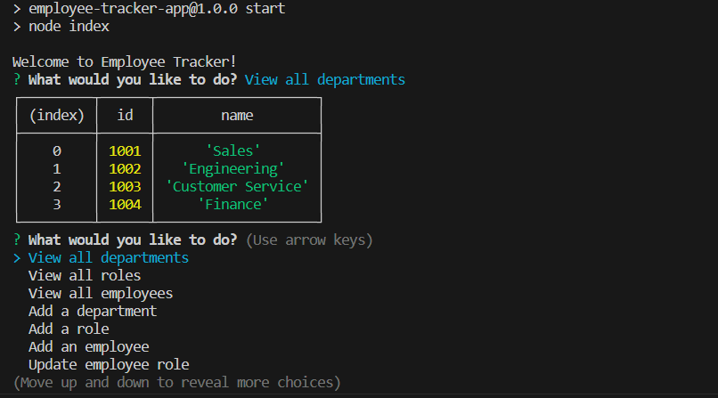
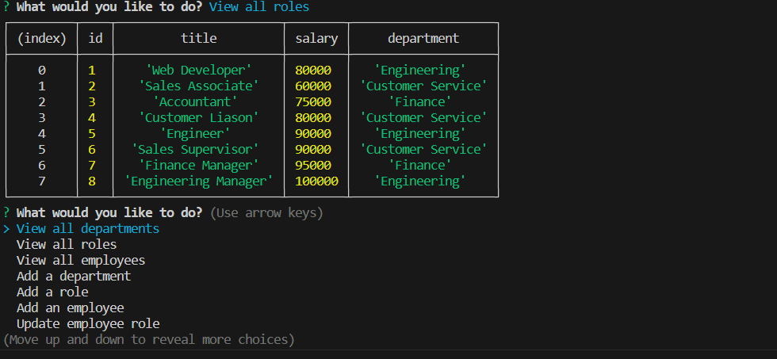
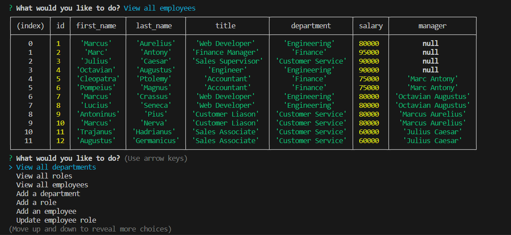

# Employee-Tracker
This is a command-line application that allows users to manage departments, roles, and employees within a company.

## Installation
To install and run the application, follow these steps:

- Clone the repository to your local machine.
- Navigate to the application's directory.
- Install the required dependencies by running the command: npm install
- Set up the database by executing the database schema and seeds    provided in the /db directory.
- Start the application by running the command: npm start

## Dependencies
- inquirer ver. 8.4.2
- mysql2

## Technologies Used
- HTML
- CSS
- JavaScript
- Node.js

## Usage
Upon starting the application, you will be presented with the following options:

- View all departments
- View all roles
- View all employees
- Add a department
- Add a role
- Add an employee
- Update an employee role

### View all departments
Selecting this option will display a formatted table showing the names and IDs of all departments in the database.

### View all roles
Selecting this option will display a formatted table showing the job titles, role IDs, department names, and salaries for all roles in the database.

### View all employees
Selecting this option will display a formatted table showing employee data, including employee IDs, first names, last names, job titles, departments, salaries, and the managers they report to.

### Add a department
By choosing this option, you can add a new department to the database. You will be prompted to enter the name of the department, and it will be added accordingly.

### Add a role
Selecting this option allows you to add a new role to the database. You will be prompted to enter the name, salary, and department for the role, and it will be added to the database.

### Add an employee
By choosing this option, you can add a new employee to the database. You will be prompted to enter the employee's first name, last name, role, and manager. Once entered, the employee will be added to the database.

### Update an employee role
Selecting this option will allow you to update an employee's role in the database. You will be prompted to select the employee you want to update and provide their new role. The information will be updated accordingly.

## Credits
The Employee-Tracker was developed by Leandro Mangubat.

Email: leandromangubat@hotmail.com 

Github: [github.com/leandromangubat](https://github.com/leandromangubat)

## License
This application is licensed under the MIT License.